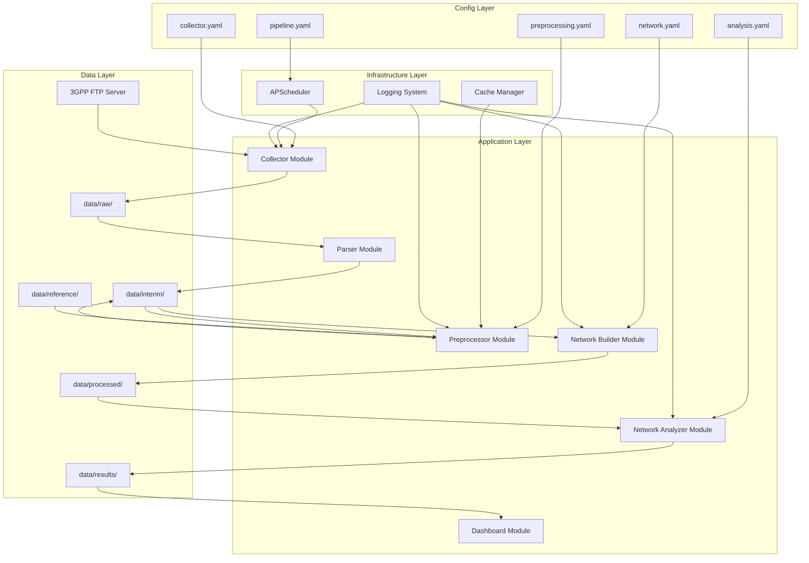

# Design Document

**버전**: 1.1  
**작성일**: 2025  
**언어 정책**: 본 문서는 한국어로 작성하되, 3GPP, TSG, WG, TDoc, Work Item, Release, Edge, Parquet 등 고유 기술 용어는 영어 원문을 그대로 사용한다.

---

## Overview

본 시스템은 3GPP 표준화 기구의 기고서(TDoc) 메타데이터를 수집·전처리하여 기업 간 협력 구조를 네트워크로 분석하고, 그 결과를 인터랙티브 대시보드로 제공하는 지속적 분석 파이프라인이다.

### 핵심 설계 목표

1. **자동화**: 수작업 개입 없이 주기적으로 데이터 수집 및 분석 실행
2. **확장성**: 새로운 TSG/WG 추가 시 설정 파일 수정만으로 대응
3. **재현성**: 동일 입력에 대해 항상 동일한 결과 생성
4. **모듈성**: 각 파이프라인 단계를 독립적으로 실행 및 테스트 가능

### 시스템 범위

```
┌─────────────────────────────────────────────────────────────────────────────┐
│                         3GPP Network Analysis Pipeline                       │
├─────────────────────────────────────────────────────────────────────────────┤
│                                                                             │
│  ┌──────────┐   ┌──────────┐   ┌──────────┐   ┌──────────┐   ┌──────────┐  │
│  │  Stage 1 │   │Stage 1.5 │   │  Stage 2 │   │  Stage 3 │   │  Stage 4 │  │
│  │Collector │──▶│  Parser  │──▶│  Title   │──▶│Membership│──▶│   WI     │  │
│  │   FTP    │   │  xlsx→df │   │  Filter  │   │Extraction│   │ Explode  │  │
│  └──────────┘   └──────────┘   └──────────┘   └──────────┘   └──────────┘  │
│       │                                                            │        │
│       ▼                                                            ▼        │
│  data/raw/                                                   data/interim/  │
│                                                                             │
│  ┌──────────┐   ┌──────────┐   ┌──────────┐   ┌──────────┐                 │
│  │  Stage 5 │   │  Stage 6 │   │  Stage 7 │   │  Stage 8 │                 │
│  │ Temporal │──▶│ Network  │──▶│ Network  │──▶│Dashboard │                 │
│  │ Enrich   │   │ Builder  │   │ Analyzer │   │Streamlit │                 │
│  └──────────┘   └──────────┘   └──────────┘   └──────────┘                 │
│       │              │              │              │                        │
│       ▼              ▼              ▼              ▼                        │
│  data/interim/  data/processed/ data/results/   localhost:8501              │
│                                                                             │
└─────────────────────────────────────────────────────────────────────────────┘
```

---

## Architecture

### 전체 아키텍처

시스템은 **계층화된 모듈 구조**를 채택하여 각 컴포넌트의 책임을 명확히 분리한다.



### 디렉토리 구조

```
3gpp-network-analysis/
├── config/                          # 설정 파일
│   ├── collector.yaml               # FTP 수집 설정
│   ├── preprocessing.yaml           # 전처리 규칙
│   ├── network.yaml                 # 네트워크 구성 파라미터
│   ├── analysis.yaml                # 분석 파라미터
│   └── pipeline.yaml                # 스케줄러 설정
│
├── data/                            # 데이터 저장소
│   ├── raw/                         # 원본 xlsx 파일
│   │   ├── RAN/
│   │   ├── SA/
│   │   └── CT/
│   ├── interim/                     # 전처리 중간 결과 (Parquet)
│   ├── processed/                   # 네트워크 Edge list (Parquet)
│   ├── results/                     # 분석 결과 (CSV, Parquet)
│   └── reference/                   # 참조 데이터
│       ├── etsi_membership.xlsx     # ETSI 멤버십 목록
│       ├── company_manual_mapping.xlsx  # 수작업 매핑
│       └── unmatched_sources.csv    # 미매칭 Source 기록
│
├── src/                             # 소스 코드
│   ├── __init__.py
│   ├── collector/                   # Stage 1: 수집
│   │   ├── __init__.py
│   │   └── ftp_collector.py
│   ├── parser/                      # Stage 1.5: 파싱
│   │   ├── __init__.py
│   │   └── xlsx_parser.py
│   ├── preprocessor/                # Stage 2-5: 전처리
│   │   ├── __init__.py
│   │   ├── title_filter.py
│   │   ├── membership_extractor.py
│   │   ├── wi_exploder.py
│   │   └── temporal_enricher.py
│   ├── network/                     # Stage 6: 네트워크 구성
│   │   ├── __init__.py
│   │   ├── company_network.py
│   │   └── wi_network.py
│   ├── analyzer/                    # Stage 7: 분석
│   │   ├── __init__.py
│   │   ├── statistics.py
│   │   ├── centrality.py
│   │   ├── community.py
│   │   └── advanced.py
│   ├── dashboard/                   # Stage 8: 시각화
│   │   ├── __init__.py
│   │   ├── app.py
│   │   └── components/
│   ├── scheduler/                   # 자동 스케줄링
│   │   ├── __init__.py
│   │   └── pipeline_scheduler.py
│   └── utils/                       # 공통 유틸리티
│       ├── __init__.py
│       ├── config_loader.py
│       ├── cache_manager.py
│       └── logger.py
│
├── tests/                           # 테스트
│   ├── __init__.py
│   ├── conftest.py
│   ├── test_collector.py
│   ├── test_parser.py
│   ├── test_preprocessor.py
│   ├── test_network.py
│   └── test_analyzer.py
│
├── raw/                             # 기존 노트북 (참조 전용, 수정 금지)
│
├── requirements.txt
├── pyproject.toml
└── README.md
```

---

## Components and Interfaces

### 1. Collector Module (Stage 1)

FTP 서버에서 TDoc List xlsx 파일을 수집하는 모듈.

```python
class FTPCollector:
    """3GPP FTP 서버에서 TDoc List 파일을 수집하는 클래스."""
    
    def __init__(self, config: CollectorConfig):
        """
        Args:
            config: collector.yaml에서 로드한 설정 객체
        """
        pass
    
    def discover_files(self) -> List[TDocFileInfo]:
        """FTP 서버에서 다운로드 대상 파일 목록을 탐색.
        
        Returns:
            TDocFileInfo 객체 리스트 (tsg, wg, mtg, filename 포함)
        """
        pass
    
    def download_file(self, file_info: TDocFileInfo) -> DownloadResult:
        """단일 파일을 다운로드.
        
        Args:
            file_info: 다운로드할 파일 정보
            
        Returns:
            DownloadResult (success, local_path, error_message)
        """
        pass
    
    def collect_all(self) -> CollectionReport:
        """전체 수집 프로세스 실행.
        
        Returns:
            CollectionReport (총 파일 수, 성공/실패 수, 실패 목록)
        """
        pass
```

**인터페이스**:
- **입력**: `config/collector.yaml` 설정
- **출력**: `data/raw/{TSG}/TDoc_List_Meeting_{TSG}#{MTG}.xlsx`
- **부수 효과**: 수집 이력 로그 기록

### 2. Parser Module (Stage 1.5)

xlsx 파일을 표준화된 DataFrame으로 파싱하는 모듈.

```python
class TDocParser:
    """TDoc List xlsx 파일을 표준화된 DataFrame으로 파싱."""
    
    REQUIRED_COLUMNS = ['TDoc', 'Title', 'Source']
    # 'Type' 컬럼은 원본 데이터에 근거가 없어 제외 (2026-09 노트북 재검증 결과)
    OUTPUT_COLUMNS = ['TDoc', 'Title', 'Source', 'Related WIs', 
                      'Release', 'Uploaded', 'TSG', 'WG', 'MTG']
    
    def __init__(self, config: PreprocessingConfig):
        pass
    
    def parse_file(self, file_path: Path) -> Optional[pd.DataFrame]:
        """단일 xlsx 파일을 파싱.
        
        Args:
            file_path: xlsx 파일 경로
            
        Returns:
            표준화된 DataFrame 또는 None (파싱 실패 시)
        """
        pass
    
    def parse_all(self, raw_dir: Path) -> pd.DataFrame:
        """모든 xlsx 파일을 파싱하여 병합.
        
        Returns:
            병합된 DataFrame
        """
        pass
    
    def extract_release(self, release_str: str) -> Optional[int]:
        """Release 문자열에서 정수 버전 추출.
        
        Examples:
            'Rel-15' -> 15
            'Release 16' -> 16
            'R17' -> 17
        """
        pass
```

**인터페이스**:
- **입력**: `data/raw/{TSG}/*.xlsx`
- **출력**: `data/interim/parsed_tdocs.parquet`

### 3. Preprocessor Module (Stage 2-5)

전처리 파이프라인을 구성하는 모듈들.

#### 3.1 Title Filter (Stage 2)

```python
class TitleFilter:
    """Title 기반으로 분석 대상 외 기고서를 필터링."""
    
    def __init__(self, exclude_patterns: List[str]):
        """
        Args:
            exclude_patterns: 제외할 패턴 리스트 (case-insensitive regex)
        """
        pass
    
    def filter(self, df: pd.DataFrame) -> Tuple[pd.DataFrame, FilterStats]:
        """Title 필터링 수행.
        
        Returns:
            (필터링된 DataFrame, 필터링 통계)
        """
        pass
```

#### 3.2 Membership-based Extractor (Stage 3)

**핵심 개선 사항**: 기존 3단계(Explode → Filter → Matching)를 1단계로 통합. requirements.md v3.1에서 Source 정제 및 멤버십 정규화 8단계 규칙이 명시되었다.

##### 3.2.1 SourceCleaner 클래스

Source 문자열에서 멤버십 기업명을 탐색하기 전에 정제 규칙을 적용한다.

```python
class SourceCleaner:
    """Source 문자열 정제 규칙 적용."""
    
    def __init__(self, config: SourceCleaningConfig):
        """
        Args:
            config: source_cleaning 설정
                - special_replacements: 특수 치환 (예: CMCC → China Mobile)
                - remove_characters: 제거할 문자 목록 ([, ], .)
                - add_word_boundary_spaces: 단어 경계 공백 추가 여부
        """
        self.special_replacements = config.special_replacements
        self.remove_characters = config.remove_characters
        self.add_word_boundary = config.add_word_boundary_spaces
    
    def clean(self, source: str) -> str:
        """Source 문자열 정제.
        
        정제 순서:
        1. 특수 치환 (CMCC → China Mobile) - MCC 필터링 전 예외처리
        2. 대괄호 제거 ([, ])
        3. 마침표 제거 (.)
        4. 앞뒤 공백 추가 (단어 경계 매칭용)
        
        Args:
            source: 원본 Source 문자열
            
        Returns:
            정제된 Source 문자열
        """
        pass
    
    def clean_batch(self, sources: List[str]) -> List[str]:
        """복수 Source 문자열 일괄 정제."""
        pass
```

**Source 정제 알고리즘**:

```
입력: Source = "Samsung Electronics Co., Ltd., [CMCC], Chair"

1. CMCC → China Mobile 치환 (MCC 필터링 전 예외처리)
   → "Samsung Electronics Co., Ltd., [China Mobile], Chair"
2. 대괄호 제거
   → "Samsung Electronics Co, Ltd, China Mobile, Chair"
3. 마침표 제거
   → "Samsung Electronics Co, Ltd, China Mobile, Chair"
4. 단어 경계 공백 추가
   → " Samsung Electronics Co, Ltd, China Mobile, Chair "

출력: " Samsung Electronics Co, Ltd, China Mobile, Chair "
```

##### 3.2.2 MembershipNormalizer 클래스

ETSI 멤버십 기업명을 8단계 규칙으로 정규화하여 검색 테이블을 구축한다.

```python
class MembershipNormalizer:
    """ETSI 멤버십 기업명 정규화 (8단계 순차 적용)."""
    
    def __init__(self, config: NormalizationConfig):
        """
        Args:
            config: membership_normalization 설정 객체
        """
        self.config = config
        self._normalization_stages = [
            ('stopwords', self._remove_stopwords),
            ('countries', self._remove_countries),
            ('removes', self._remove_specific),
            ('replaces', self._apply_replaces),
            ('brackets', self._remove_brackets),
            ('startswith', self._merge_startswith),
            ('suffix', self._remove_suffix),
            ('prefix', self._remove_prefix),
        ]
    
    def normalize(self, company_name: str) -> str:
        """단일 기업명 정규화.
        
        8단계 규칙을 순서대로 적용 (개수는 2026-09 원본 노트북 재검증 결과 정정됨):
        a) stopwords 제거 - 법인격(47개) + 일반 단어(15개), 총 62개
        b) countries 제거 - 국가명 suffix (23개)
        c) removes 제거 - 지명 (4개)
        d) replaces 특수 매핑 - 특정 기업명 변환 (15개)
        e) brackets 괄호 제거 - (...) 형태 제거
        f) startswith 통합 - 정렬 후 prefix 기반 통합
        g) suffix 제거 - 접미어 (54개)
        h) prefix 제거 - 접두어 (8개)
        
        Args:
            company_name: 원본 기업명
            
        Returns:
            정규화된 기업명
        """
        pass
    
    def normalize_with_trace(self, company_name: str) -> Tuple[str, List[NormalizationStep]]:
        """정규화 단계별 추적 정보 포함.
        
        Returns:
            (정규화된 기업명, 단계별 변환 기록)
        """
        pass
    
    def build_lookup_table(self, membership_df: pd.DataFrame) -> Dict[str, str]:
        """멤버십 DataFrame을 정규화하여 검색 테이블 구축.
        
        Args:
            membership_df: ETSI 멤버십 원본 DataFrame
            
        Returns:
            Dict[정규화된_기업명 → 표준_기업명]
        """
        pass
    
    def get_stage_statistics(self, membership_df: pd.DataFrame) -> pd.DataFrame:
        """정규화 단계별 고유 기업 수 변화 통계.
        
        Returns:
            DataFrame (stage, unique_companies, reduction)
        """
        pass
    
    # 내부 정규화 단계 메서드
    def _remove_stopwords(self, name: str) -> str:
        """a) 법인격 및 일반 단어 제거."""
        pass
    
    def _remove_countries(self, name: str) -> str:
        """b) 국가명 suffix 제거."""
        pass
    
    def _remove_specific(self, name: str) -> str:
        """c) 특정 지명 제거."""
        pass
    
    def _apply_replaces(self, name: str) -> str:
        """d) 특수 매핑 적용."""
        pass
    
    def _remove_brackets(self, name: str) -> str:
        """e) 괄호 및 내용 제거."""
        pass
    
    def _merge_startswith(self, name: str) -> str:
        """f) prefix 기반 통합 (예외 목록 제외)."""
        pass
    
    def _remove_suffix(self, name: str) -> str:
        """g) 접미어 제거."""
        pass
    
    def _remove_prefix(self, name: str) -> str:
        """h) 접두어 제거."""
        pass
```

**정규화 단계별 영향도 (참고 — 2026-09 원본 노트북 재검증 결과, requirements.md와 일치하도록 정정)**:

| 단계 | 고유 기업 수 | 감소 |
|------|-------------|------|
| 원본 멤버십 (중복 제거 전) | 789 | - |
| 중복 제거 (unique members) | 787 | -2 |
| a) stopwords | 737 | -50 |
| b) countries | 668 | -69 |
| c) removes | 662 | -6 |
| d) replaces | 659 | -3 |
| e) brackets | 648 | -11 |
| f) startswith | 582 | -66 |
| g) suffix | (원본 노트북에 미기록) | - |
| h) prefix | (원본 노트북에 미기록) | - |

g)·h) 단계 이후 최종 고유 기업 수는 원본 노트북에도 기록되어 있지 않다. 새 구현에서는 반드시 이 수치를 산출하여 검증을 완료해야 한다 (요구사항 4의 "영향도 분석" 참고).

##### 3.2.3 MembershipExtractor 클래스

```python
class MembershipExtractor:
    """Source 문자열에서 ETSI 멤버십 기업명을 직접 추출."""
    
    def __init__(self, 
                 membership_df: pd.DataFrame,
                 manual_mapping: pd.DataFrame,
                 config: NormalizationConfig,
                 cache_manager: Optional['CacheManager'] = None):
        """
        Args:
            membership_df: ETSI 멤버십 DataFrame
            manual_mapping: 수작업 매핑 (alias → standard_name)
            config: 정규화 설정 (source_cleaning + membership_normalization)
            cache_manager: 매핑 결과 캐시용 (요구사항 4.9). CacheManager를 재사용하되
                캐시 키는 "입력 Source 목록의 해시"로 생성한다 (요구사항 7.2의
                파일 mtime 기반 캐시와는 별개 키 전략).
        """
        self.source_cleaner = SourceCleaner(config.source_cleaning)
        self.normalizer = MembershipNormalizer(config.membership_normalization)
        self.manual_mapping = manual_mapping
        self.cache_manager = cache_manager
        self._build_lookup_table(membership_df)
    
    def _compute_source_hash(self, sources: List[str]) -> str:
        """입력 Source 목록의 해시 계산 (캐시 키, 요구사항 4.9)."""
        pass
    
    def _build_lookup_table(self, membership_df: pd.DataFrame) -> None:
        """멤버십 기업명 + 수작업 alias를 포함한 검색 테이블 구축.
        
        검색 테이블 구성:
        1. 멤버십 기업명을 정규화하여 테이블에 추가
        2. 수작업 매핑의 alias를 테이블에 추가
        3. 대소문자 무시를 위해 소문자 버전도 함께 저장
        """
        pass
    
    def extract_companies(self, source: str) -> List[str]:
        """단일 Source 문자열에서 기업명 리스트 추출.
        
        처리 흐름:
        1. Source 정제 (SourceCleaner)
        2. 정규화된 멤버십 기업명으로 직접 탐색 (case-insensitive)
        3. 매칭된 기업명 리스트 반환
        
        Args:
            source: "Samsung Electronics Co., Ltd., Nokia, Chair"
            
        Returns:
            ["Samsung Electronics", "Nokia"]
            (Chair는 멤버십에 없으므로 자동 제외)
        """
        pass
    
    def process(self, df: pd.DataFrame) -> Tuple[pd.DataFrame, ExtractionStats]:
        """전체 DataFrame 처리.
        
        `cache_manager`가 설정된 경우, Source 목록 해시(_compute_source_hash)를
        캐시 키로 사용해 이전 매핑 결과를 재사용한다 (요구사항 4.9).
        
        Returns:
            (추출/분리된 DataFrame, 추출 통계)
        """
        pass
    
    def get_unmatched_sources(self) -> pd.DataFrame:
        """매칭되지 않은 Source 목록 반환."""
        pass
```

**멤버십 기반 추출 알고리즘**:

```
입력: Source = "Samsung Electronics Co., Ltd., [CMCC], Chair"
     Membership = {"Samsung Electronics", "Nokia", "Huawei", "China Mobile", ...}

1. Source 정제 (SourceCleaner)
   - CMCC → China Mobile
   - 대괄호 제거
   - 마침표 제거
   - 단어 경계 공백 추가
   → " Samsung Electronics Co, Ltd, China Mobile, Chair "

2. 정규화된 멤버십으로 탐색
   - 정규화된 멤버십 테이블에서 각 기업명을 Source에서 검색
   - case-insensitive 매칭
   - 매칭 발견 시 표준 기업명으로 변환하여 결과에 추가

3. 결과 반환
출력: ["Samsung Electronics", "China Mobile"]
- "Chair"는 멤버십에 없으므로 자동 제외
- "Co., Ltd." 잘못 분리 문제 원천 해결
```

#### 3.3 WI Exploder (Stage 4)

```python
class WIExploder:
    """복수 Work Item을 개별 행으로 분리."""
    
    def __init__(self, delimiters: List[str], exclude_patterns: List[str]):
        pass
    
    def explode(self, df: pd.DataFrame) -> Tuple[pd.DataFrame, ExplodeStats]:
        """Work Item 분리 및 필터링.
        
        Returns:
            (분리된 DataFrame, 분리 통계)
        """
        pass
```

#### 3.4 Temporal Enricher (Stage 5)

```python
class TemporalEnricher:
    """시간 정보(Year, Quarter) 추가 및 필터링."""
    
    def __init__(self, date_range: DateRange):
        pass
    
    def enrich(self, df: pd.DataFrame) -> Tuple[pd.DataFrame, EnrichStats]:
        """시간 정보 추가 및 범위 필터링.
        
        Returns:
            (시간 정보 추가된 DataFrame, 처리 통계)
        """
        pass
```

### 4. Network Builder Module (Stage 6)

네트워크 Edge list를 생성하는 모듈.

```python
class CompanyNetworkBuilder:
    """기업 간 협력 네트워크 Edge list 생성."""
    
    def __init__(self, config: NetworkConfig):
        pass
    
    def build_edges(self, 
                    df: pd.DataFrame,
                    tsg_group: str,
                    time_unit: str,
                    time_value: Union[int, str],
                    threshold: int) -> pd.DataFrame:
        """특정 조건에 대한 Edge list 생성.
        
        Args:
            df: 전처리된 DataFrame
            tsg_group: 'ALL', 'RAN', 'SA', 'CT'
            time_unit: 'year', 'release', 'quarter'
            time_value: 시간 값 (예: 2023, 17, '2023Q1')
            threshold: Weight 임계값
            
        Returns:
            Edge list DataFrame (Source, Target, Weight, Work_Items)
        """
        pass
    
    def build_all(self, df: pd.DataFrame) -> Dict[str, pd.DataFrame]:
        """모든 조합에 대한 Edge list 생성."""
        pass


class WINetworkBuilder:
    """Work Item 간 협력 네트워크 Edge list 생성."""
    
    def build_edges(self, 
                    df: pd.DataFrame,
                    tsg_group: str,
                    time_unit: str,
                    time_value: Union[int, str],
                    threshold: int) -> pd.DataFrame:
        """특정 조건에 대한 WI-to-WI Edge list 생성."""
        pass
```

**Edge 생성 알고리즘**:

```python
# 기업 간 네트워크 Edge 생성
def create_company_edges(df: pd.DataFrame) -> pd.DataFrame:
    """
    동일 Work Item에 기고한 기업들의 모든 쌍(combination)을 Edge로 생성.
    
    1. Work Item별로 그룹화
    2. 각 WI 내에서 기업 중복 제거
    3. 기업 쌍의 모든 조합(combinations) 생성
    4. (A,B)와 (B,A) 정규화 (정렬하여 중복 제거)
    5. 동일 기업 쌍의 WI 수를 Weight로 집계
    """
    edges = []
    for wi, group in df.groupby('Work Item'):
        companies = group['company'].unique()
        for pair in itertools.combinations(sorted(companies), 2):
            edges.append({
                'Source': pair[0],
                'Target': pair[1],
                'Work Item': wi
            })
    
    edge_df = pd.DataFrame(edges)
    # Weight = 고유 Work Item 수
    weight_df = edge_df.groupby(['Source', 'Target']).size().reset_index(name='Weight')
    return weight_df
```

### 5. Network Analyzer Module (Stage 7)

네트워크 분석을 수행하는 모듈.

```python
class NetworkStatistics:
    """네트워크 기본 통계 계산."""
    
    def compute(self, G: nx.Graph) -> NetworkStats:
        """
        Returns:
            NetworkStats (nodes, edges, weighted_edges, avg_degree,
                         avg_weighted_degree, density, connected_components,
                         diameter, avg_path_length, modularity, 
                         avg_clustering_coefficient)
        """
        pass


class CentralityAnalyzer:
    """중심성 분석.
    
    모든 중심성은 비가중(unweighted)으로 계산한다: nx.degree_centrality(G),
    nx.betweenness_centrality(G), nx.closeness_centrality(G),
    nx.eigenvector_centrality(G, max_iter=...)에 weight 인자를 전달하지 않는다
    (요구사항 11.1 참고 — 원본 노트북과 동일한 unweighted 방식).
    """
    
    def __init__(self, eigenvector_max_iter: int = 1000):
        """
        Args:
            eigenvector_max_iter: config/analysis.yaml의 eigenvector_max_iter.
                원본 노트북은 NetworkX 기본값(100)을 그대로 썼고 미수렴 예외
                (PowerIterationFailedConvergence)를 처리하지 않아 크래시했다.
                본 구현은 1000으로 완화하고 반드시 try/except로 감싸 null 처리한다.
        """
        pass
    
    def compute_all(self, G: nx.Graph) -> pd.DataFrame:
        """모든 중심성 지표 계산.
        
        Returns:
            DataFrame (node, degree_centrality, betweenness_centrality,
                      closeness_centrality, eigenvector_centrality)
        """
        pass


class CommunityDetector:
    """커뮤니티 탐지.
    
    라이브러리: python-louvain (`import community.community_louvain as community_louvain`),
    `community_louvain.best_partition(G, random_state=random_seed)` 사용.
    원본 노트북은 `randomize=True`로 의도적 비결정 실행을 했으나(seed 미고정),
    본 시스템은 요구사항 16.2(재현성)를 만족하기 위해 seed를 고정한다 —
    원본과 동일한 커뮤니티 구조가 재현되지는 않는다.
    modularity는 `networkx.algorithms.community.modularity(G, communities)`로 별도 계산한다.
    NetworkStatistics(요구사항 10)가 modularity를 필요로 하므로, CommunityDetector.detect()를
    먼저 실행하고 그 결과를 NetworkStatistics에 전달하여 Louvain 중복 실행을 피한다.
    """
    
    def __init__(self, random_seed: int = 42):
        pass
    
    def detect(self, G: nx.Graph) -> CommunityResult:
        """Louvain 알고리즘으로 커뮤니티 탐지.
        
        Returns:
            CommunityResult (node_communities, community_sizes, modularity)
        """
        pass


class AdvancedAnalyzer:
    """고급 네트워크 분석.
    
    **적용 범위 (요구사항 12 참고)**: analyze_power_law/compute_small_world/
    extract_mst/analyze_centrality_correlation은 TSG × 연도(time_unit=year) ×
    threshold=0 조합에만 실행한다. sensitivity_analysis만 threshold 0~9를
    스윕하되 대표 시간 값에 한정한다. 원본 노트북도 이 규모의 조합을 실행한
    이력이 없으므로, 이 범위 제한은 요구사항 16.1(30분 성능 예산)을 지키기
    위한 신규 설계 결정이다.
    """
    
    def analyze_power_law(self, G: nx.Graph) -> PowerLawResult:
        """Degree 분포의 Power-law 적합성 검증.
        
        `powerlaw.Fit(degrees)`로 exponent(alpha), xmin을 구하고,
        `fit.distribution_compare('power_law', 'lognormal')` 등으로 p-value를
        추가 계산한다 (원본 노트북은 exponent만 계산, p-value는 신규 추가).
        """
        pass
    
    def compute_small_world(self, G: nx.Graph, num_samples: int = 100) -> SmallWorldResult:
        """Small-world 지수 σ = (C/C_rand)/(L/L_rand) 계산.
        
        num_samples개의 Erdős–Rényi 무작위 네트워크(nx.gnm_random_graph, 동일
        노드·엣지 수)를 생성해 평균 C_rand, L_rand를 구한 뒤 σ를 실제로
        계산한다 (config/analysis.yaml의 random_network_samples 사용).
        원본 노트북은 C_rand/L_rand를 실측값과 나란히 출력만 했을 뿐 σ 비율을
        계산한 적이 없어 전적으로 신규 구현이다. nx.sigma()는 대규모 그래프에서
        느리므로 직접 사용하지 않고 위 방식으로 구현한다.
        """
        pass
    
    def extract_mst(self, G: nx.Graph) -> nx.Graph:
        """Maximum Spanning Tree 추출 (nx.maximum_spanning_tree(G, weight='Weight'))."""
        pass
    
    def analyze_centrality_correlation(self, 
                                       networks: Dict[str, nx.Graph]) -> pd.DataFrame:
        """TSG 그룹별 Degree Centrality 순위 간 Spearman 상관계수.
        
        Degree Centrality를 순위(rank)로 변환한 뒤 scipy.stats.spearmanr 또는
        `.corr(method='spearman')`을 사용한다 (원본 노트북은 순위가 아닌 원본
        값에 pandas 기본값 Pearson을 적용한 오류가 있었으므로 재현하지 않는다).
        """
        pass
    
    def sensitivity_analysis(self, 
                            df: pd.DataFrame,
                            thresholds: List[int]) -> pd.DataFrame:
        """Threshold별 네트워크 지표 민감도 분석 (대표 시간 값에 한정, 요구사항 12 참고)."""
        pass
```

### 6. Dashboard Module (Stage 8)

인터랙티브 대시보드를 제공하는 Streamlit 앱.

```python
# src/dashboard/app.py

import streamlit as st

class DashboardApp:
    """Streamlit 기반 인터랙티브 대시보드."""
    
    def __init__(self):
        self._load_data()
    
    def _load_data(self) -> None:
        """분석 결과 데이터 로드."""
        pass
    
    def render_sidebar(self) -> FilterSelection:
        """사이드바 필터 패널 렌더링.
        
        Returns:
            FilterSelection (tsg_group, time_unit, time_range, 
                           threshold, network_type)
        """
        pass
    
    def render_network_graph(self, filters: FilterSelection) -> None:
        """Plotly 네트워크 그래프 렌더링."""
        pass
    
    def render_statistics_chart(self, filters: FilterSelection) -> None:
        """시계열 통계 차트 렌더링."""
        pass
    
    def render_centrality_table(self, filters: FilterSelection) -> None:
        """Centrality 순위 테이블 렌더링."""
        pass
    
    def render_community_view(self, filters: FilterSelection) -> None:
        """커뮤니티 구조 뷰 렌더링."""
        pass
```

### 7. Infrastructure Components

#### 7.1 Config Loader

```python
@dataclass
class CollectorConfig:
    ftp_host: str
    ftp_base_path_template: str   # 예: "/tsg_{tsg_lower}/TSG_{tsg}/TSGR_{mtg}/Docs/"
    targets: List[CollectorTarget]  # CollectorTarget에 tsg, min_meeting, wg_list 포함
    max_retry: int
    retry_delay: int

@dataclass
class SourceCleaningConfig:
    """Source 문자열 정제 설정."""
    special_replacements: Dict[str, str]  # 예: {"CMCC": "China Mobile"}
    remove_characters: List[str]          # 예: ["[", "]", "."]
    add_word_boundary_spaces: bool        # 단어 경계 공백 추가 여부

@dataclass
class NormalizationConfig:
    """멤버십 정규화 8단계 설정. (개수는 2026-09 원본 노트북 재검증 결과 정정됨)"""
    # a) stopwords - 법인격(47개) + 일반 단어(15개) 제거, 총 62개
    stopwords: List[str]
    
    # b) countries - 국가명 suffix 제거 (23개)
    countries: List[str]
    
    # c) removes - 특정 지명 제거 (4개)
    removes: List[str]
    
    # d) replaces - 특수 매핑 (15개)
    replaces: Dict[str, str]
    
    # e) brackets - 괄호 제거 패턴 (여는 괄호 기준 분리: re.split(brackets_pattern, name)[0])
    brackets_pattern: str  # 예: "\\s\\("
    
    # f) startswith - 통합 예외 목록
    startswith_exceptions: List[str]  # 예: ["BTL", "CISA ECD", "Intelsat", "IIIT Bangalore"]
    
    # g) suffix - 접미어 제거 (54개)
    suffix: List[str]
    
    # h) prefix - 접두어 제거 (8개)
    prefix: List[str]

@dataclass
class PreprocessingConfig:
    title_exclude_patterns: List[str]
    source_cleaning: SourceCleaningConfig
    membership_normalization: NormalizationConfig
    wi_delimiters: List[str]
    wi_exclude_patterns: List[str]
    date_range: DateRange

def load_config(config_name: str) -> Any:
    """YAML 설정 파일 로드."""
    pass
```

#### 7.2 Cache Manager

```python
class CacheManager:
    """전처리 결과 캐싱 관리."""
    
    def get_cache_key(self, input_files: List[Path]) -> str:
        """입력 파일들의 수정 시각 기반 캐시 키 생성."""
        pass
    
    def is_valid(self, cache_key: str) -> bool:
        """캐시 유효성 검증."""
        pass
    
    def load(self, cache_key: str) -> Optional[pd.DataFrame]:
        """캐시된 결과 로드."""
        pass
    
    def save(self, cache_key: str, df: pd.DataFrame) -> None:
        """결과를 캐시에 저장."""
        pass
```

#### 7.3 Pipeline Scheduler

```python
class PipelineScheduler:
    """APScheduler 기반 파이프라인 자동 스케줄링."""
    
    def __init__(self, config: PipelineConfig):
        pass
    
    def start(self) -> None:
        """스케줄러 시작."""
        pass
    
    def stop(self) -> None:
        """스케줄러 중지."""
        pass
    
    def run_pipeline(self) -> PipelineResult:
        """전체 파이프라인 실행."""
        pass
```

---

## Data Models

### 1. 입력 데이터 모델

#### TDoc List xlsx 스키마

| 컬럼명 | 타입 | 설명 | 필수 |
|--------|------|------|------|
| TDoc | string | 기고서 ID (예: R1-2301234) | ✓ |
| Title | string | 기고서 제목 | ✓ |
| Source | string | 제출 주체 (기업명, 복수 가능) | ✓ |
| Related WIs | string | 관련 Work Item (복수 가능) | |
| Release | string | 릴리즈 정보 (예: Rel-17) | |
| Uploaded | datetime | 업로드 일시 | |
| Type | string | 기고서 유형 | |

### 2. 중간 데이터 모델

#### Parsed TDoc DataFrame

```python
@dataclass
class ParsedTDocSchema:
    TDoc: str                    # 기고서 ID
    Title: str                   # 기고서 제목
    Source: str                  # 원본 Source 문자열
    Related_WIs: str             # 원본 Work Item 문자열
    Release: Optional[int]       # 정수 릴리즈 번호
    Uploaded: datetime           # 업로드 일시
    TSG: str                     # TSG 그룹 (RAN, SA, CT)
    WG: str                      # Working Group
    MTG: int                     # 회차 번호
```

#### Preprocessed DataFrame

```python
@dataclass
class PreprocessedSchema:
    TDoc: str
    Title: str
    company: str                 # 정규화된 기업명 (단일)
    Work_Item: str               # Work Item (단일)
    Release: int
    Year: int
    Quarter: str                 # 'YYYYQN' 형식
    TSG: str
    WG: str
```

### 3. 출력 데이터 모델

#### Company Network Edge List

```python
@dataclass
class CompanyEdgeSchema:
    Source: str                  # 기업명 A
    Target: str                  # 기업명 B (정렬됨, Source < Target)
    Weight: int                  # 공동 기고 Work Item 수
    Work_Items: List[str]        # 공동 기고한 WI 목록 (선택적)
```

#### WI Network Edge List

```python
@dataclass
class WIEdgeSchema:
    Source: str                  # Work Item A
    Target: str                  # Work Item B
    Weight: int                  # 공동 기고 기업 수
    Companies: List[str]         # 공동 기고한 기업 목록 (선택적)
```

#### Network Statistics

```python
@dataclass
class NetworkStatsSchema:
    tsg_group: str
    time_unit: str
    time_value: Union[int, str]
    threshold: int
    nodes: int
    edges: int
    weighted_edges: int
    avg_degree: float
    avg_weighted_degree: float
    density: float
    connected_components: int
    diameter: Optional[int]
    avg_path_length: Optional[float]
    modularity: float
    avg_clustering_coefficient: float
```

#### Centrality Results

```python
@dataclass
class CentralitySchema:
    node: str
    tsg_group: str
    time_unit: str
    time_value: Union[int, str]
    degree_centrality: float
    betweenness_centrality: float
    closeness_centrality: float
    eigenvector_centrality: Optional[float]
    community_id: int
```

### 4. 보조 결과/통계 타입 (2026-09 스펙 검수 반영 — 앞서 메서드 시그니처에 등장하지만 정의되지 않았던 타입 보강)

```python
@dataclass
class TDocFileInfo:
    tsg: str
    wg: str
    mtg: int
    filename: str
    remote_path: str

@dataclass
class DownloadResult:
    success: bool
    local_path: Optional[Path]
    error_message: Optional[str]

@dataclass
class CollectionReport:
    total_files: int
    success_count: int
    failed_count: int
    failed_files: List[TDocFileInfo]

@dataclass
class FilterStats:
    """Title/WI 패턴 필터링 공통 통계 (요구사항 3.4, 5.4)."""
    total_rows: int
    excluded_rows: int
    excluded_by_pattern: Dict[str, int]

@dataclass
class ExtractionStats:
    """멤버십 기반 추출 통계 (요구사항 4.8)."""
    input_rows: int
    output_rows: int              # explode 이후 행 수
    unmatched_source_count: int   # 추출된 기업 0개인 Source 수
    unique_companies: int

@dataclass
class NormalizationStep:
    """정규화 단계별 추적 정보 (normalize_with_trace)."""
    stage_name: str
    before: str
    after: str

@dataclass
class ExplodeStats:
    """WI Explode 통계 (요구사항 5.4)."""
    input_rows: int
    output_rows: int
    excluded_wi_count: int
    excluded_by_pattern: Dict[str, int]

@dataclass
class EnrichStats:
    """Temporal Enrichment 통계 (요구사항 6.3)."""
    input_rows: int
    output_rows: int
    excluded_count: int
    excluded_reason: str

@dataclass
class PipelineResult:
    """Scheduler 실행 결과 (요구사항 14.4)."""
    success: bool
    stages_completed: List[str]
    error_message: Optional[str]
    started_at: datetime
    completed_at: Optional[datetime]

@dataclass
class FilterSelection:
    """Dashboard 사이드바 선택 값 (요구사항 13.1)."""
    tsg_group: str
    time_unit: str
    time_range: Tuple[Union[int, str], Union[int, str]]
    threshold: int
    network_type: str  # 'company' | 'workitem'

@dataclass
class CommunityResult:
    """커뮤니티 탐지 결과 (요구사항 11.4, 11.5)."""
    node_communities: Dict[str, int]       # node -> community_id
    community_sizes: Dict[int, int]        # community_id -> size
    modularity: float

@dataclass
class PowerLawResult:
    """Power-law 적합성 검증 결과 (요구사항 12.1)."""
    alpha: float       # exponent
    xmin: float
    p_value: Optional[float]

@dataclass
class SmallWorldResult:
    """Small-world 지수 계산 결과 (요구사항 12.2)."""
    sigma: float
    c_actual: float
    c_random_avg: float
    l_actual: float
    l_random_avg: float
```

---

## Error Handling

### 1. FTP 수집 오류

| 오류 유형 | 처리 방식 | 재시도 |
|----------|----------|--------|
| 연결 실패 | 로그 기록 후 재시도 | 최대 3회 |
| 파일 없음 | 경고 로그 기록, 건너뜀 | X |
| 다운로드 중단 | 부분 파일 삭제, 재시도 | 최대 3회 |
| 인증 실패 | 오류 로그 기록, 종료 | X |

### 2. 파싱 오류

| 오류 유형 | 처리 방식 |
|----------|----------|
| 필수 컬럼 누락 | 해당 파일 건너뜀, 경고 로그 |
| 파일명 패턴 불일치 | 해당 파일 건너뜀, 경고 로그 |
| 인코딩 오류 | UTF-8, CP949 순차 시도 |
| 날짜 파싱 오류 | null 처리, 경고 로그 |

### 3. 전처리 오류

| 오류 유형 | 처리 방식 |
|----------|----------|
| 기업 매칭 실패 | unmatched_sources.csv 기록 |
| 빈 결과 | 경고 로그, 빈 DataFrame 반환 |

### 4. 분석 오류

| 오류 유형 | 처리 방식 |
|----------|----------|
| LCC < 2 노드 | diameter, avg_path_length를 null 처리 |
| Eigenvector 미수렴 | null 처리, 경고 로그 |
| 메모리 부족 | 단계별 처리, GC 호출 |

### 오류 로깅 형식

```python
{
    "timestamp": "2025-01-15T10:30:00Z",
    "level": "ERROR",
    "module": "collector",
    "stage": "download",
    "message": "파일 다운로드 실패",
    "details": {
        "file": "TDoc_List_Meeting_RAN#100.xlsx",
        "error_type": "ConnectionError",
        "retry_count": 3
    }
}
```

---

## Testing Strategy

### 1. 단위 테스트

#### 핵심 로직 테스트

| 모듈 | 테스트 대상 | 테스트 방식 |
|------|------------|------------|
| Parser | Release 파싱 | 다양한 형식 입력에 대한 정확한 파싱 검증 |
| MembershipExtractor | 기업명 추출 | 정상/비정상 Source에 대한 추출 검증 |
| CompanyNetworkBuilder | Edge 생성 | 예상 Edge 수 및 Weight 검증 |
| NetworkStatistics | 통계 계산 | 알려진 그래프에 대한 계산 검증 |

#### 모의 데이터셋

```python
# tests/conftest.py

@pytest.fixture
def sample_parsed_df():
    """테스트용 파싱 완료 DataFrame."""
    return pd.DataFrame({
        'TDoc': ['R1-001', 'R1-002', 'R1-003'],
        'Title': ['Test Doc 1', 'Test Doc 2', 'Test Doc 3'],
        'Source': [
            'Samsung Electronics, Nokia',
            'Samsung Electronics',
            'Nokia, Huawei'
        ],
        'Related WIs': ['WI_A', 'WI_A, WI_B', 'WI_B'],
        'Release': [17, 17, 17],
        'Uploaded': pd.to_datetime(['2023-01-01', '2023-01-02', '2023-01-03']),
        'TSG': ['RAN', 'RAN', 'RAN'],
        'WG': ['RAN1', 'RAN1', 'RAN1'],
        'MTG': [100, 100, 100]
    })

@pytest.fixture
def sample_membership():
    """테스트용 멤버십 DataFrame."""
    return pd.DataFrame({
        'simple': ['Samsung Electronics', 'Nokia', 'Huawei', 'Ericsson']
    })
```

### 2. Round-trip 테스트

```python
def test_parquet_roundtrip(sample_preprocessed_df, tmp_path):
    """Parquet 직렬화/역직렬화 round-trip 테스트."""
    path = tmp_path / "test.parquet"
    
    # Write
    sample_preprocessed_df.to_parquet(path)
    
    # Read
    loaded_df = pd.read_parquet(path)
    
    # Verify
    pd.testing.assert_frame_equal(sample_preprocessed_df, loaded_df)
```

### 3. 통합 테스트

```python
def test_full_pipeline(sample_raw_files, tmp_path):
    """전체 파이프라인 통합 테스트."""
    # Setup
    config = load_test_config()
    
    # Execute
    collector = FTPCollector(config)
    parser = TDocParser(config)
    preprocessor = Preprocessor(config)
    builder = CompanyNetworkBuilder(config)
    analyzer = NetworkAnalyzer(config)
    
    # Verify each stage
    raw_files = collector.collect_all()
    assert len(raw_files.successful) > 0
    
    parsed_df = parser.parse_all(tmp_path / "raw")
    assert not parsed_df.empty
    
    preprocessed_df = preprocessor.process(parsed_df)
    assert not preprocessed_df.empty
    
    edges = builder.build_all(preprocessed_df)
    assert len(edges) > 0
    
    stats = analyzer.compute_statistics(edges)
    assert stats is not None
```

### 4. 성능 테스트

```python
@pytest.mark.performance
def test_preprocessing_performance(large_dataset):
    """전처리 성능 테스트 (30분 이내 완료)."""
    import time
    
    start = time.time()
    
    preprocessor = Preprocessor(load_config())
    result = preprocessor.process(large_dataset)
    
    elapsed = time.time() - start
    
    assert elapsed < 1800  # 30분
```

---

## Correctness Properties

*A property is a characteristic or behavior that should hold true across all valid executions of a system—essentially, a formal statement about what the system should do. Properties serve as the bridge between human-readable specifications and machine-verifiable correctness guarantees.*

### Property 1: 파일명 패턴 파싱 정확성

*For any* 유효한 TDoc List 파일명 형식 `TDoc_List_Meeting_{TSG}#{MTG}.xlsx`에 대해, 파싱 결과는 정확한 TSG와 MTG 값을 추출해야 한다.

**Validates: Requirements 1.2**

```python
# Property test example
@given(
    tsg=st.sampled_from(['RAN', 'SA', 'CT']),
    mtg=st.integers(min_value=69, max_value=200)
)
def test_filename_parsing(tsg, mtg):
    filename = f"TDoc_List_Meeting_{tsg}#{mtg}.xlsx"
    result = parse_filename(filename)
    assert result.tsg == tsg
    assert result.mtg == mtg
```

### Property 2: 로컬 파일 존재 시 다운로드 스킵

*For any* 로컬에 이미 존재하는 파일에 대해, Collector는 해당 파일을 재다운로드하지 않아야 한다.

**Validates: Requirements 1.4**

```python
@given(
    existing_files=st.lists(st.text(min_size=5, max_size=50), min_size=1, max_size=10),
    target_files=st.lists(st.text(min_size=5, max_size=50), min_size=1, max_size=10)
)
def test_skip_existing_files(existing_files, target_files):
    # 로컬에 존재하는 파일 중 다운로드 대상에 있는 파일은 스킵되어야 함
    to_download = get_files_to_download(existing_files, target_files)
    for f in existing_files:
        if f in target_files:
            assert f not in to_download
```

### Property 3: DataFrame 파싱 및 스키마 일관성

*For any* 유효한 TDoc List xlsx 파일에 대해, 파싱된 DataFrame은 표준 스키마를 준수하고, 파일명에서 추출한 메타데이터(TSG, WG, MTG)가 모든 행에 일관되게 추가되어야 한다.

**Validates: Requirements 2.1, 2.3**

```python
@given(xlsx_data=valid_xlsx_data_strategy())
def test_dataframe_schema_consistency(xlsx_data):
    result = parse_tdoc_file(xlsx_data)
    
    # 필수 컬럼 존재 확인
    for col in ['TDoc', 'Title', 'Source', 'TSG', 'WG', 'MTG']:
        assert col in result.columns
    
    # 메타데이터 일관성 확인
    assert result['TSG'].nunique() == 1
    assert result['WG'].nunique() == 1
    assert result['MTG'].nunique() == 1
```

### Property 4: Release 파싱 정확성

*For any* Release 문자열 형식("Rel-N", "Release N", "RN" 등)에 대해, 추출된 정수 릴리즈 번호는 원본 문자열에 포함된 숫자와 일치해야 한다.

**Validates: Requirements 2.2**

```python
@given(release_num=st.integers(min_value=1, max_value=30))
def test_release_parsing(release_num):
    formats = [
        f"Rel-{release_num}",
        f"Release {release_num}",
        f"R{release_num}",
        f"rel{release_num}"
    ]
    for fmt in formats:
        result = extract_release(fmt)
        assert result == release_num
```

### Property 5: Parquet 직렬화 Round-trip

*For any* 유효한 전처리 DataFrame에 대해, Parquet 형식으로 직렬화 후 역직렬화한 결과는 원본과 동등해야 한다.

**Validates: Requirements 2.6**

```python
@given(df=valid_preprocessed_dataframe_strategy())
def test_parquet_roundtrip(df, tmp_path):
    path = tmp_path / "test.parquet"
    df.to_parquet(path)
    loaded = pd.read_parquet(path)
    pd.testing.assert_frame_equal(df, loaded)
```

### Property 6: 패턴 기반 필터링 일관성

*For any* 제외 패턴과 Title/Work Item 문자열에 대해, 패턴을 포함하는 문자열은 대소문자와 관계없이 항상 필터링되어야 하고, 패턴을 포함하지 않는 문자열은 항상 유지되어야 한다.

**Validates: Requirements 3.2, 3.3, 5.3**

```python
@given(
    pattern=st.text(min_size=2, max_size=10),
    case_variant=st.sampled_from(['upper', 'lower', 'title', 'mixed'])
)
def test_pattern_filtering_case_insensitive(pattern, case_variant):
    # 패턴의 대소문자 변형 생성
    if case_variant == 'upper':
        test_title = f"Document: {pattern.upper()} related"
    elif case_variant == 'lower':
        test_title = f"Document: {pattern.lower()} related"
    elif case_variant == 'title':
        test_title = f"Document: {pattern.title()} related"
    else:
        test_title = f"Document: {''.join(c.upper() if i%2 else c.lower() for i,c in enumerate(pattern))} related"
    
    filter_result = apply_title_filter([pattern], test_title)
    assert filter_result == True  # 필터링되어야 함
```

### Property 7: 멤버십 기반 기업 추출 정확성

*For any* Source 문자열과 ETSI 멤버십 목록에 대해, 추출된 기업명은 반드시 멤버십 목록에 존재해야 하며, 비기업 요소(Chair, MCC 등)는 자동으로 제외되어야 한다. 또한, 법인격 suffix 유무와 대소문자 변형에 관계없이 동일한 기업은 동일하게 매칭되어야 한다.

**Validates: Requirements 4.1, 4.2, 4.3, 4.4**

```python
@given(
    companies=st.lists(st.sampled_from(['Samsung Electronics', 'Nokia', 'Huawei', 'Ericsson']), min_size=1, max_size=5),
    non_companies=st.lists(st.sampled_from(['Chair', 'MCC', 'RAN1', 'SA2', 'TSG']), min_size=0, max_size=3),
    suffixes=st.lists(st.sampled_from(['Co., Ltd.', 'Inc.', 'GmbH', 'Corporation', '']), min_size=0)
)
def test_membership_extraction(companies, non_companies, suffixes):
    membership = ['Samsung Electronics', 'Nokia', 'Huawei', 'Ericsson']
    
    # Source 문자열 생성 (기업 + suffix + 비기업 혼합)
    source_parts = [f"{c} {s}".strip() for c, s in zip(companies, suffixes)] + non_companies
    random.shuffle(source_parts)
    source = ', '.join(source_parts)
    
    result = extract_companies(source, membership)
    
    # 모든 추출 결과는 멤버십에 존재해야 함
    for company in result:
        assert company in membership
    
    # 비기업은 추출되지 않아야 함
    for nc in non_companies:
        assert nc not in result
    
    # 원본 기업은 모두 추출되어야 함 (중복 제외)
    unique_companies = list(set(companies))
    for uc in unique_companies:
        assert uc in result
```

### Property 8: Source 문자열 정제 멱등성

*For any* Source 문자열에 대해, SourceCleaner.clean() 함수를 2회 적용한 결과는 1회 적용한 결과와 동일해야 한다 (멱등성).

**Validates: Requirements 4.2**

```python
@given(
    source=st.text(min_size=1, max_size=200, alphabet=st.characters(whitelist_categories=('L', 'N', 'P', 'Z')))
)
def test_source_cleaning_idempotent(source):
    cleaner = SourceCleaner(load_source_cleaning_config())
    
    # 1회 정제
    cleaned_once = cleaner.clean(source)
    
    # 2회 정제
    cleaned_twice = cleaner.clean(cleaned_once)
    
    # 멱등성 검증: 2회 적용 결과 == 1회 적용 결과
    assert cleaned_once == cleaned_twice
```

### Property 9: 멤버십 정규화 순서 의존성 (고정 필요)

*For any* ETSI 멤버십 기업명에 대해, 8단계 정규화 규칙은 정해진 순서(stopwords → countries → removes → replaces → brackets → startswith → suffix → prefix)로 적용해야 하며, 순서를 변경하면 결과가 달라질 수 있다. 따라서 규칙 적용 순서는 반드시 고정되어야 한다.

**Validates: Requirements 4.3**

```python
@given(
    company_name=st.sampled_from([
        'Guangdong OPPO Mobile Communication Co., Ltd. (Shenzhen)',
        'Samsung Electronics Co., Ltd. Korea',
        'Huawei Technologies Co., Ltd. Germany',
        'Nokia Corporation Finland'
    ])
)
def test_normalization_order_dependency(company_name):
    normalizer = MembershipNormalizer(load_normalization_config())
    
    # 정상 순서 적용
    result_normal = normalizer.normalize(company_name)
    
    # 순서 변경 적용 (예: suffix 먼저, 그 다음 stopwords)
    # 이 테스트는 순서 변경 시 결과가 달라질 수 있음을 검증
    # 실제로는 순서 고정을 강제하는 테스트로 사용
    
    # 동일 입력에 대해 항상 동일한 결과 (재현성)
    result_repeat = normalizer.normalize(company_name)
    assert result_normal == result_repeat
    
    # 정규화 단계 추적으로 순서 검증
    _, trace = normalizer.normalize_with_trace(company_name)
    expected_order = ['stopwords', 'countries', 'removes', 'replaces', 
                      'brackets', 'startswith', 'suffix', 'prefix']
    actual_order = [step.stage_name for step in trace]
    assert actual_order == expected_order
```

### Property 10: CMCC 예외처리 정확성

*For any* CMCC 문자열이 포함된 Source에 대해, Source 정제 시 CMCC는 반드시 China Mobile로 변환되어야 하며, 이후 멤버십 추출에서 China Mobile로 매칭되어야 한다. 이는 MCC 필터링 규칙에 의해 CMCC가 잘못 제거되는 것을 방지한다.

**Validates: Requirements 4.2**

```python
@given(
    prefix=st.text(min_size=0, max_size=50, alphabet=st.characters(whitelist_categories=('L', 'N', 'P', 'Z'))),
    suffix=st.text(min_size=0, max_size=50, alphabet=st.characters(whitelist_categories=('L', 'N', 'P', 'Z')))
)
def test_cmcc_exception_handling(prefix, suffix):
    # CMCC가 포함된 Source 생성
    source = f"{prefix}, CMCC, {suffix}"
    
    cleaner = SourceCleaner(load_source_cleaning_config())
    cleaned = cleaner.clean(source)
    
    # CMCC는 China Mobile로 변환되어야 함
    assert 'CMCC' not in cleaned
    assert 'China Mobile' in cleaned
    
    # 멤버십 추출 시 China Mobile이 추출되어야 함
    extractor = MembershipExtractor(
        load_membership_df(),
        load_manual_mapping_df(),
        load_normalization_config()
    )
    companies = extractor.extract_companies(source)
    
    # China Mobile이 멤버십에 있다면 추출되어야 함
    membership_has_china_mobile = 'China Mobile' in extractor._lookup_table.values()
    if membership_has_china_mobile:
        assert 'China Mobile' in companies
```

### Property 11: 정규화 단계별 기업 수 단조 감소

*For any* ETSI 멤버십 기업명 집합에 대해, 각 정규화 단계를 적용한 후의 고유 기업 수는 이전 단계보다 감소하거나 동일해야 하며, 절대 증가해서는 안 된다 (단조 감소 또는 동일).

**Validates: Requirements 4.3**

```python
@given(
    membership_names=st.lists(
        st.text(min_size=5, max_size=100, alphabet=st.characters(whitelist_categories=('L', 'N', 'P', 'Z'))),
        min_size=10,
        max_size=100
    )
)
def test_normalization_monotonic_reduction(membership_names):
    normalizer = MembershipNormalizer(load_normalization_config())
    
    # 단계별 고유 기업 수 추적
    stage_counts = []
    current_names = set(membership_names)
    stage_counts.append(('original', len(current_names)))
    
    stages = ['stopwords', 'countries', 'removes', 'replaces', 
              'brackets', 'startswith', 'suffix', 'prefix']
    
    for stage in stages:
        # 해당 단계만 적용
        normalized_names = set()
        for name in current_names:
            # 단계별 적용 (내부 메서드 사용)
            normalized = getattr(normalizer, f'_remove_{stage}' if stage != 'replaces' else '_apply_replaces')(name)
            normalized_names.add(normalized)
        
        stage_counts.append((stage, len(normalized_names)))
        current_names = normalized_names
    
    # 단조 감소 검증: 각 단계의 기업 수 <= 이전 단계의 기업 수
    for i in range(1, len(stage_counts)):
        prev_stage, prev_count = stage_counts[i-1]
        curr_stage, curr_count = stage_counts[i]
        assert curr_count <= prev_count, \
            f"기업 수가 증가함: {prev_stage}({prev_count}) → {curr_stage}({curr_count})"
```

### Property 12: Explode 후 행 수 정확성

*For any* 복수 기업 또는 복수 Work Item을 포함한 레코드에 대해, explode 후 행 수는 분리된 요소 수와 정확히 일치해야 한다.

**Validates: Requirements 4.7, 5.2**

```python
@given(
    num_items=st.integers(min_value=1, max_value=10),
    delimiter=st.sampled_from([',', ';'])
)
def test_explode_row_count(num_items, delimiter):
    items = [f"Item_{i}" for i in range(num_items)]
    source_string = delimiter.join(items)
    
    df = pd.DataFrame({'items': [source_string]})
    result = explode_items(df, 'items', delimiter)
    
    assert len(result) == num_items
```

### Property 13: 날짜 변환 및 범위 필터링 정확성

*For any* 유효한 날짜에 대해, 추출된 Year는 날짜의 연도와 일치하고, Quarter는 월에 따라 올바르게 계산되어야 한다(1-3월: Q1, 4-6월: Q2, 7-9월: Q3, 10-12월: Q4). 또한, 설정된 날짜 범위를 벗어나는 레코드는 필터링되어야 한다.

**Validates: Requirements 6.1, 6.2**

```python
@given(
    date=st.datetimes(min_value=datetime(2010, 1, 1), max_value=datetime(2030, 12, 31))
)
def test_temporal_enrichment(date):
    result = enrich_temporal(date)
    
    assert result['Year'] == date.year
    
    expected_quarter = (date.month - 1) // 3 + 1
    assert result['Quarter'] == f"{date.year}Q{expected_quarter}"


@given(
    date=st.datetimes(),
    min_year=st.integers(min_value=2010, max_value=2020),
    max_year=st.integers(min_value=2025, max_value=2030)
)
def test_date_range_filtering(date, min_year, max_year):
    result = filter_by_date_range(date, min_year, max_year)
    
    if min_year <= date.year <= max_year:
        assert result == True  # 범위 내 → 유지
    else:
        assert result == False  # 범위 외 → 필터링
```

### Property 14: 캐시 무효화 정확성

*For any* 입력 파일 집합에 대해, 파일의 수정 시각이 변경되지 않으면 캐시를 재사용하고, 하나라도 변경되면 캐시를 무효화해야 한다.

**Validates: Requirements 7.2**

```python
@given(
    file_mtimes=st.lists(st.floats(min_value=0, max_value=1e10), min_size=1, max_size=10),
    mtime_changes=st.lists(st.booleans(), min_size=1, max_size=10)
)
def test_cache_invalidation(file_mtimes, mtime_changes):
    # 첫 번째 실행 → 캐시 생성
    cache_key_1 = compute_cache_key(file_mtimes)
    
    # 수정 시각 변경 시뮬레이션
    new_mtimes = [m + 1 if c else m for m, c in zip(file_mtimes, mtime_changes)]
    cache_key_2 = compute_cache_key(new_mtimes)
    
    if any(mtime_changes[:len(file_mtimes)]):
        assert cache_key_1 != cache_key_2  # 변경 시 캐시 무효화
    else:
        assert cache_key_1 == cache_key_2  # 무변경 시 캐시 유지
```

### Property 15: Edge 생성 정확도

*For any* Work Item에 참여한 n개의 기업에 대해, 생성되는 Edge 수는 nC2 = n(n-1)/2이어야 하고, 모든 Edge는 정규화되어 (Source < Target) 유일해야 하며, Weight는 두 기업이 공동으로 기고한 고유 Work Item 수와 일치해야 한다. 또한, threshold 이하의 Weight를 가진 Edge는 필터링되어야 한다.

**Validates: Requirements 8.1, 8.2, 8.3, 8.5, 9.1, 9.2, 9.3**

```python
@given(
    num_companies=st.integers(min_value=2, max_value=10),
    threshold=st.integers(min_value=0, max_value=5)
)
def test_edge_generation(num_companies, threshold):
    companies = [f"Company_{i}" for i in range(num_companies)]
    wi = "WI_Test"
    
    df = pd.DataFrame({'company': companies, 'Work Item': [wi] * num_companies})
    edges = create_company_edges(df, threshold=0)
    
    # Edge 수 검증
    expected_edges = num_companies * (num_companies - 1) // 2
    assert len(edges) == expected_edges
    
    # 정규화 검증 (Source < Target)
    for _, row in edges.iterrows():
        assert row['Source'] < row['Target']
    
    # 유일성 검증
    edge_pairs = set(zip(edges['Source'], edges['Target']))
    assert len(edge_pairs) == len(edges)


@given(
    weights=st.lists(st.integers(min_value=1, max_value=10), min_size=5, max_size=20),
    threshold=st.integers(min_value=0, max_value=10)
)
def test_edge_threshold_filtering(weights, threshold):
    edges = pd.DataFrame({
        'Source': [f"A_{i}" for i in range(len(weights))],
        'Target': [f"B_{i}" for i in range(len(weights))],
        'Weight': weights
    })
    
    filtered = apply_weight_threshold(edges, threshold)
    
    # threshold 이하의 Edge는 모두 제거되어야 함
    assert all(filtered['Weight'] > threshold)
```

### Property 16: 네트워크 통계 계산 정확성

*For any* 그래프에 대해, 계산된 통계 지표(nodes, edges, density 등)는 그래프 이론적 정의와 일치해야 하며, diameter와 avg_path_length는 Largest Connected Component 기준으로 계산되어야 한다(LCC 노드 수 2개 미만이면 null).

**Validates: Requirements 10.1, 10.2, 10.3**

```python
@given(
    num_nodes=st.integers(min_value=2, max_value=50),
    edge_probability=st.floats(min_value=0.1, max_value=0.9)
)
def test_network_statistics(num_nodes, edge_probability):
    # Erdős–Rényi 랜덤 그래프 생성
    G = nx.erdos_renyi_graph(num_nodes, edge_probability)
    stats = compute_network_statistics(G)
    
    # 기본 지표 검증
    assert stats['nodes'] == num_nodes
    assert stats['edges'] == G.number_of_edges()
    
    expected_density = 2 * G.number_of_edges() / (num_nodes * (num_nodes - 1)) if num_nodes > 1 else 0
    assert abs(stats['density'] - expected_density) < 1e-9
    
    # LCC 기반 지표 검증
    if nx.is_connected(G):
        assert stats['diameter'] is not None
        assert stats['avg_path_length'] is not None
    else:
        lcc = max(nx.connected_components(G), key=len)
        if len(lcc) < 2:
            assert stats['diameter'] is None
            assert stats['avg_path_length'] is None
```

### Property 17: 중심성 정규화

*For any* 그래프의 모든 노드에 대해, 계산된 중심성 값(Degree, Betweenness, Closeness, Eigenvector)은 0과 1 사이의 값이어야 한다.

**Validates: Requirements 11.2**

```python
@given(graph=random_graph_strategy(min_nodes=5, max_nodes=50))
def test_centrality_normalization(graph):
    centralities = compute_all_centralities(graph)
    
    for centrality_type in ['degree', 'betweenness', 'closeness', 'eigenvector']:
        values = centralities[f'{centrality_type}_centrality']
        # null 값 제외하고 범위 검증
        valid_values = [v for v in values if v is not None]
        for v in valid_values:
            assert 0 <= v <= 1
```

### Property 18: Maximum Spanning Tree 속성

*For any* 연결된 가중 그래프에 대해, 추출된 Maximum Spanning Tree는 (1) 모든 노드를 포함하고, (2) 정확히 n-1개의 Edge를 가지며, (3) 가중치 합이 최대여야 한다.

**Validates: Requirements 12.3**

```python
@given(graph=connected_weighted_graph_strategy())
def test_mst_properties(graph):
    mst = extract_maximum_spanning_tree(graph)
    
    # 속성 1: 모든 노드 포함
    assert set(mst.nodes()) == set(graph.nodes())
    
    # 속성 2: n-1 개의 Edge
    assert mst.number_of_edges() == mst.number_of_nodes() - 1
    
    # 속성 3: 연결성
    assert nx.is_connected(mst)
    
    # 속성 4: 최대 가중치 합 (다른 스패닝 트리와 비교)
    mst_weight = sum(d['weight'] for u, v, d in mst.edges(data=True))
    # 최대성은 Kruskal/Prim 알고리즘의 정확성에 의해 보장됨
```

### Property 19: 파이프라인 재현성

*For any* 동일한 입력 데이터와 설정 파일에 대해, 파이프라인을 반복 실행했을 때 커뮤니티 탐지를 포함한 모든 분석 결과가 동일해야 한다.

**Validates: Requirements 11.4, 16.2**

```python
@given(seed=st.integers(min_value=0, max_value=1000))
def test_pipeline_reproducibility(seed, sample_data, sample_config):
    # 첫 번째 실행
    result_1 = run_pipeline(sample_data, sample_config, random_seed=seed)
    
    # 두 번째 실행
    result_2 = run_pipeline(sample_data, sample_config, random_seed=seed)
    
    # 모든 결과 동등성 검증
    pd.testing.assert_frame_equal(result_1['statistics'], result_2['statistics'])
    pd.testing.assert_frame_equal(result_1['centralities'], result_2['centralities'])
    pd.testing.assert_frame_equal(result_1['communities'], result_2['communities'])
```

